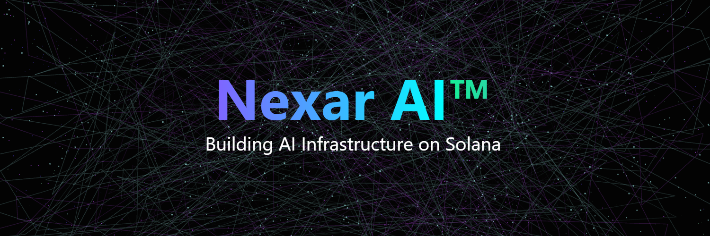

# Nexar AI™ Synapse Protocol SDK

<div align="center">
  
  <h3>Decentralized AI Protocol on Solana</h3>
  
  [](https://opensource.org/licenses/MIT)
</div>

## Overview

Nexar AI™ Synapse Protocol is a revolutionary decentralized AI protocol built on Solana that enables real-time, multi-agent collaboration and self-learning systems. Our protocol combines the power of artificial intelligence with blockchain technology to create a new paradigm of decentralized applications.

### Key Features

- **10x Faster dApps**: Enhanced performance through AI-powered optimization
- **Scalable Intelligence**: Grows smarter with each interaction
- **24/7 Always Active**: Continuous learning and adaptation
- **Enterprise-Grade Security**: Multi-layered security architecture with real-time threat detection
- **High Performance**: Process thousands of transactions per second with minimal latency
- **Easy Integration**: Comprehensive SDK with support for multiple programming languages

## Quick Start

### Installation

```bash
npm install @nexarai/synapse-protocol
```

### Basic Usage

```typescript
import { SynapseProtocol } from '@nexarai/synapse-protocol';

// Initialize the protocol
const synapse = new SynapseProtocol({
  network: 'mainnet-beta',
  wallet: 'path/to/wallet.json'
});

// Connect to Neural Mesh
const mesh = await synapse.connectToMesh({
  nodeType: 'compute',
  capacity: 'high'
});

// Deploy an AI model
const model = await synapse.deployModel({
  type: 'prediction',
  file: './models/predictor.onnx',
  config: {
    inputShape: [1, 28, 28],
    outputShape: [1, 10]
  }
});

// Start processing with automatic scaling
await model.start();
```

## Documentation

For detailed documentation, visit [https://www.nexar.sh/docs/synapse](https://www.nexar.sh/docs/synapse)

## Use Cases

### DeFi Optimization
Optimize trading strategies, liquidity pools, and yield farming with AI-powered decision making.

```typescript
const optimizer = new DeFiOptimizer({
  pool: 'SOL/USDC',
  strategy: 'dynamic_fees',
  riskTolerance: 'medium'
});

await optimizer.start();
```

### DAO Governance
Enhance DAO decision-making with AI-powered proposal analysis and voting recommendations.

```typescript
const governance = new Governance({
  votingPeriod: '7d',
  quorum: 0.51,
  proposalThreshold: 100000
});

governance.onProposal(async (proposal) => {
  const analysis = await governance.analyzeImpact(proposal);
  await governance.publishAnalysis(proposal.id, analysis);
});
```

### Supply Chain Management
Optimize supply chain operations with predictive analytics and real-time tracking.

```typescript
const supplyChain = new SupplyChainManager({
  optimizationTargets: ['inventory', 'logistics'],
  predictionHorizon: '7d'
});

await supplyChain.start();
```

## Architecture

Synapse Protocol employs a sophisticated multi-layered architecture:

1. **AI Processing Layer**: Neural networks and machine learning models
2. **Blockchain Layer**: Solana blockchain integration
3. **Application Layer**: User-facing interfaces and API integrations

Each layer is optimized for its specific purpose while maintaining seamless communication with other components.

## Security

Security is our top priority. The protocol implements:

- End-to-end encryption for all communications
- Real-time threat detection and prevention
- Automated security auditing
- Regular third-party security audits
- Bug bounty program


### Development Setup

```bash
# Clone the repository
git clone https://github.com/NexarAI/synapse-protocol.git
cd synapse-protocol

# Install dependencies
npm install

# Run tests
npm test

# Build the project
npm run build
```

## License

This project is licensed under the MIT License.

## Acknowledgments

Special thanks to our contributors and the Solana community for their continued support and feedback.

---

<div align="center">
  <sub>Built with ❤️ by the Nexar AI™ Team</sub>
</div> 
